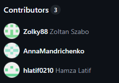

# 🛒 E-Commerce Campaign & Content Management Tool  
**Project by Berlin Brands Group (BBG)**  
🛠️ Private Repository · Collaborator Access Only  

---

## 🔍 Overview  
A custom-built internal CMS tool used by the Shop Management Team at **Berlin Brands Group (BBG)** to create, manage, and schedule campaigns across BBG's e-commerce platforms.

---

## 👤 My Role  
**PHP & SQL Developer** (Collaborator)  
- Integrated custom modules for content scheduling and dynamic rendering  
- Extended backend logic using **PHP**, **MySQL**, and **Smarty** templating  
- Collaborated with a distributed team via GitHub and internal task boards

---

## 🧰 Tech Stack  
- PHP (OOP)  
- MySQL  
- Smarty Templates  
- JavaScript, jQuery  
- Bootstrap (UI Components)  

---

## ✨ Key Contributions  
- Developed logic to dynamically load campaign blocks using date-based filters  
- Wrote secure SQL queries for campaign data handling  
- Built admin interface enhancements for easier content scheduling  
- Debugged and optimized legacy Smarty templates for better UI performance  

---

## 👥 Contributors (as per GitHub Insights)  

---

## 📌 Notes  
This is a **case study only**. The original repository is **private and owned by BBG**. No source code is shared here due to confidentiality.

---

## 📁 Screenshots or Mockups (optional)  
_Add UI sketches, flowcharts, or feature outlines if allowed._

---

## 🔗 How to Reference This in Interviews/Portfolio  
Mention this GitHub page in your resume, LinkedIn, or during interviews to showcase:  
- Real-world team collaboration  
- PHP + SQL development on live business tools  
- Contribution to a known brand's internal tech stack  
